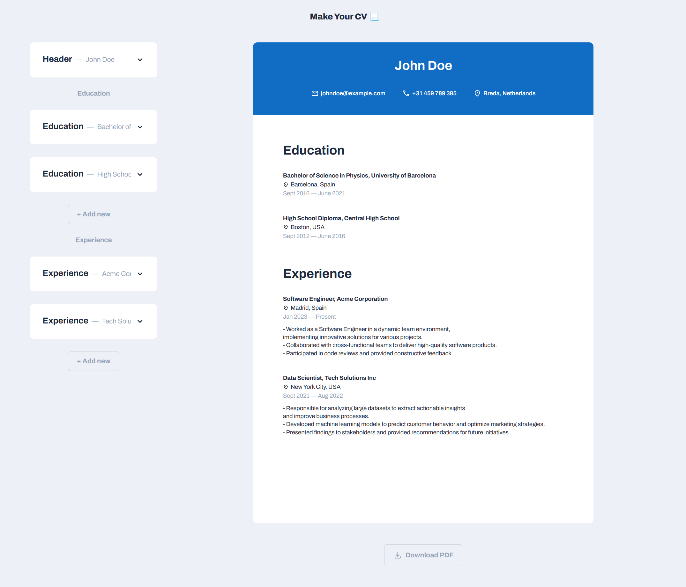

# Make Your CV 📃

One page CV builder web app.

## Demo

<p align="center">
  
</p>
<h2 align="center">
  <a href="https://amadeuio.github.io/make-your-cv">👉 Demo</a>
</h2>

## Features

- Enter your information on the forms and the CV will be updated in real time
- Expand each form to edit, collapse when desired
- Drag-and-drop the forms to organize chronologically
- Responsive: Enters 'Collapse Mode' on smaller screens
- Download the CV in PDF format

## Tech Stack

- **UI:** React
- **Languages:** TypeScript, CSS, HTML
- **Build Tool:** Vite
- **Dependencies:** react-beautiful-dnd, uuid, html2canvas, jspdf

## File Structure

- `/src`: Contains the source code

  - `/src/components`: Individual UI components used throughout the application
  - `/src/icons`: Components with SVG icons
  - `/src/styles`: CSS styles
  - `/src/App.tsx`: Main component responsible for managing state and rendering components of the whole application
  - `/src/main.tsx`: Entry point for the React application
  - `/src/initialData.tsx`: Initial placeholder data
  - `/src/types.ts`: TypeScript type definitions for the data

- `/docs`: Distribution files generated during the build, GitHub pages is reading the root of this directory

- `index.html`: Entry point for the application

## Run Locally

Clone the project

```bash
  git clone https://github.com/amadeuio/make-your-cv
```

Go to the project directory

```bash
  cd make-your-cv
```

Install dependencies

```bash
  npm install
```

Start the server

```bash
  npm run dev
```

## Acknowledgements

- [Design inspo by Dmitry Sergushkin](https://dribbble.com/shots/20685447-Create-Event-Form)
- [GPT](https://chat.openai.com/)
- [shields.io](https://shields.io/)

## License

[MIT](https://choosealicense.com/licenses/mit/)
